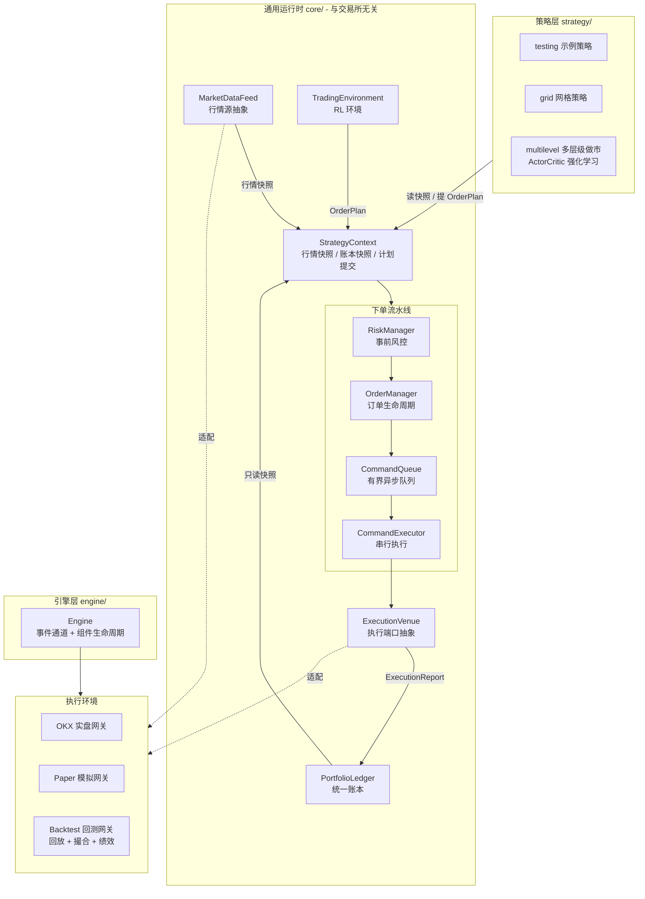
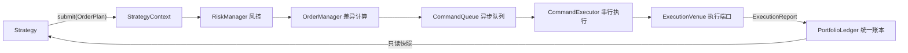
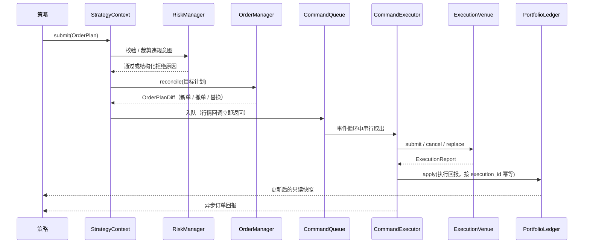
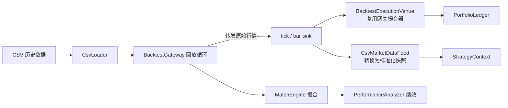

# qitrader — 事件驱动量化交易系统

qitrader 是一个基于 C++23 与 Boost.Asio 协程构建的**事件驱动量化交易系统**，支持回测、模拟交易（Paper Trading）和 OKX 实盘三种执行环境，并通过一套与交易所无关的领域抽象（`core/`）让策略可以在三种环境间复用。

> 项目早期名称为 BitCoinTrader，构建目标现为 `qitrader`。

## 功能特性

- **三种执行环境**：历史数据回测、Paper 模拟交易、OKX 实盘，共用同一套策略与运行时
- **统一策略运行时**：策略只依赖领域模型与 `StrategyContext`，下单、撤单、风控、账本与订单生命周期全部由运行时托管
- **统一账本**：`PortfolioLedger` 单点维护现金、冻结资金、持仓、已实现/未实现盈亏与手续费，并生成带版本号的只读快照
- **事前风控**：订单计划进入订单管理前经过可插拔风控，支持数量、名义价值、持仓上限和单边暴露限制
- **目标订单模型**：策略描述"希望存在的订单集合"（`OrderPlan`），由 `OrderManager` 自动推导撤单、新单与替换
- **异步命令队列**：行情回调只投递计划不等待执行结果，避免嵌套同步事件导致死锁
- **强化学习接口**：`TradingEnvironment` 提供 `reset()/step()` 语义，`MarketMakingEnvironment` 将多档动作转换为订单计划并给出带成本分解的奖励
- **回测绩效分析**：自动生成净值、收益率、最大回撤、夏普比率、胜率与盈亏比报告
- **企业微信通知**：交易状态与异常实时推送

## 架构总览

### 分层结构



设计要点：

- **策略不依赖具体交易所**：策略只依赖 `StrategyContext` 与领域类型，执行环境由 `ExecutionVenue` 屏蔽
- **账本单点写入**：只有标准化执行回报能写入账本，策略侧只拿到只读快照
- **运行时端口先于策略注册**：行情适配器先注册引擎行情回调，保证策略读到的是本帧而非上一帧快照

### 职责边界

下单、撤单、风控、账本与订单生命周期全部由运行时托管，策略只做两件事：**读快照**、**提计划**。



| 关注点 | 由谁负责 | 策略是否参与 |
| --- | --- | --- |
| 下单与撤单 | `OrderManager` 按目标计划推导差异 | 否，只声明目标集合 |
| 资金与持仓 | `PortfolioLedger` 单点权威 | 否，只读快照 |
| 事前风控 | `RiskManager` 在提交前拦截并裁剪 | 否 |
| 行情快照 | `MarketDataFeed` 写入上下文 | 否，只读 |
| 订单 ID 与幂等 | `OrderManager` 统一分配 | 否 |
| 自身挂单视图 | `OrderManager::activeOrders` | 只读 |
| 交易决策 | 策略自身 | 是，唯一职责 |

需要保留引擎事件通道的原因是：网关执行端口本身架在 `kSendOrder`/`kCancelOrder` 事件之上。策略不再接收这些事件——运行时把行情转换成 `MarketSnapshot`，把成交转换成 `ExecutionReport`，策略只实现 `onMarket` / `onExecution`。

### Runtime 下单时序



关键约束：**行情回调不得等待自身的执行结果**。因此所有命令都投递到有界队列，由 `CommandExecutor` 在事件循环中串行执行，执行结果以异步回报返回。

### 回测数据链路



一次回测中只有**一份订单簿、一份成交记录和一份绩效统计**：回测执行端口复用网关的 `MatchEngine`，行情则由同一条回放驱动 `CsvMarketDataFeed`，避免重复回放导致时间线错乱。

## 目录结构

```
qitrader/
├── core/                       # 通用运行时（与交易所、引擎细节无关）
│   ├── domain/                 # 领域模型：市场、订单意图、执行回报、账本快照
│   ├── runtime/                # 策略上下文、命令队列、命令执行器、运行期组件
│   ├── portfolio/              # 统一账本
│   ├── risk/                   # 事前风控规则
│   ├── execution/              # 订单管理、执行端口抽象及回测/网关实现
│   ├── market/                 # 行情数据源抽象及 CSV / 网关实现
│   └── environment/            # 强化学习环境与做市环境
├── engine/                     # 事件引擎：事件通道与组件生命周期
├── market/                     # 市场接入
│   ├── base/                   # 网关基类（事件收发与订阅语义）
│   ├── okx/                    # OKX 实盘：REST + WebSocket
│   └── paper/                  # Paper 模拟：真实行情 + 虚拟撮合
├── backtest/                   # 回测
│   ├── base/                   # 回测网关与绩效分析器
│   ├── data/                   # CSV 数据加载
│   └── match/                  # 模拟撮合引擎
├── strategy/                   # 策略
│   ├── base/                   # 策略基类（引擎事件回调 + 统一运行时上下文）
│   ├── testing/                # 示例策略
│   ├── grid/                   # 网格策略
│   └── multilevel/             # 多层级做市 + Actor-Critic
├── notice/                     # 通知（企业微信）
├── common/                     # 配置、工具与通用类型
├── tests/                      # 核心运行时单元测试
├── scripts/                    # 数据下载与 smoke test
├── data/                       # 回测数据样例
├── openspec/                   # 变更提案与能力规格
└── xmake.lua                   # 构建配置
```

## 核心模块

| 模块 | 职责 |
| --- | --- |
| `core::domain` | 市场快照、订单意图 `OrderIntent`、目标计划 `OrderPlan`、执行回报 `ExecutionReport`、账本快照 `PortfolioSnapshot` 等领域类型 |
| `core::runtime::StrategyContext` | 策略唯一入口：读取行情与账本快照、提交订单计划；只暴露只读视图 |
| `core::runtime::CommandQueue` | 有界异步命令队列，支持计划合并、撤单优先与队列满错误 |
| `core::runtime::CommandExecutor` | 在事件循环中串行取出命令并调用执行端口 |
| `core::risk::RiskManager` | 订单数量、名义价值、持仓上限、单边暴露等事前风控 |
| `core::execution::OrderManager` | 活动订单表、订单 ID 分配、部分成交、撤单、替换与计划差异计算 |
| `core::portfolio::PortfolioLedger` | 权威账本，按 `execution_id` 幂等处理执行回报并生成带版本号快照 |
| `core::market::MarketDataFeed` | 行情数据源抽象；CSV 回放与网关行情各自实现 |
| `core::execution::ExecutionVenue` | 执行端口抽象；回测直连撮合器，实盘与 Paper 经网关适配器 |
| `core::environment::TradingEnvironment` | `reset()/step()` 强化学习接口，奖励含手续费与滑点成本分解 |
| `engine::Engine` | 并发事件通道、组件生命周期与事件分发；同步事件使用带缓冲完成信号避免丢唤醒 |
| `backtest::match::MatchEngine` | 模拟撮合：市价单按最新价即时成交，限价单按价格穿越成交 |

## 快速开始

### 构建

```bash
# 调试模式（默认）
xmake

# 发布模式
xmake config --mode=release
xmake

# 只构建单元测试
xmake build qitrader-core-tests
```

二进制输出在 `build/linux/x86_64/debug/qitrader`（发布模式为 `release`）。

### 回测

```bash
# 网格策略（默认执行端口：回测下自动使用回测撮合器）
./build/linux/x86_64/debug/qitrader --backtest \
    --strategy grid --symbol BTC-USDT \
    --data-file data/sample_btc_usdt.csv \
    --grid-upper 97500 --grid-lower 96800 --grid-count 5 --grid-amount 0.01

# 多层级做市（走统一账本、风控与订单管理）
./build/linux/x86_64/debug/qitrader --backtest \
    --strategy multilevel --symbol BTC-USDT \
    --data-file data/sample_btc_usdt.csv \
    --mm-levels 3 --mm-order-size 1 --mm-decision-interval-ms 30000
```

回测数据为 CSV，表头为：

```csv
timestamp_ms,symbol,last_price,volume,open,high,low,close
```

可用 `scripts/download_okx_data.py` 从 OKX 公开接口下载历史 K 线并转换为该格式（无需 API Key）：

```bash
python3 scripts/download_okx_data.py --symbol BTC-USDT --bar 1m --days 30
```

回测结束会输出绩效报告，包含初始资金、最终净值、总收益率、最大回撤、夏普比率、总交易次数、盈利/亏损次数、胜率与盈亏比。

### 模拟交易（Paper Trading）

```bash
./build/linux/x86_64/debug/qitrader --paper \
    --strategy grid --symbol BTC-USDT-SWAP \
    --grid-upper 100000 --grid-lower 90000 --grid-count 10
```

Paper 模式连接交易所**公共行情**，但撮合与记账在本地虚拟执行，不需要交易权限。

#### 长期运行

`scripts/paper_service.sh` 用于让 Paper 模式在后台持续运行，适合观察策略在真实行情下的长期表现：

```bash
# 在目标机器上（默认目录 /root/qitrader）
./paper_service.sh start     # 后台启动，进程意外退出后自动重启
./paper_service.sh status    # 查看运行状态与最近摘要
./paper_service.sh tail      # 实时跟踪日志
./paper_service.sh report    # 查看绩效报告
./paper_service.sh stop      # 优雅停止（会输出绩效报告）

# 自定义参数
SYMBOL=ETH-USDT CAPITAL=1000 STRATEGY=multilevel INTERVAL=60 ./paper_service.sh start
```

运行期间每 60 秒输出一行账户摘要（可用 `--report-interval` 调整）：

```text
[模拟交易摘要] 运行 12 分钟 | 净值 1001.26 | 盈亏 1.26 (0.13%) |
现金 825.70 | 持仓 0.070000 @ 2489.97 | 成交 11 笔 | 行情 870 条 | 重连 0 次
```

其中"行情条数"和"重连次数"用于判断连接健康度。停止时会输出与回测相同口径的绩效报告（收益率、最大回撤、夏普比率、胜率、盈亏比）。

**行情看门狗**：WebSocket 可能在不报错的情况下停止推送（连接仍是 ESTABLISHED，内核缓冲区还积压数据），此时读取会一直挂起，策略静默停摆且无人察觉。因此内置了看门狗——行情停滞超过 180 秒即判定连接静默挂起，主动中断并重建连接、重新订阅。触发时日志会出现：

```text
[模拟交易] 行情已停滞 183s，判定连接静默挂起，主动中断以触发重连
```

日志写入 `logs/paper.log`，超过 200MB 自动切割。高频调试日志（下单请求、挂单/撤单明细）默认不输出，需要时用 `--v=1` 开启。

### 实盘

```bash
./build/linux/x86_64/debug/qitrader --strategy multilevel --symbol BTC-USDT-SWAP
```

实盘需要可读的 `config.ini`；缺失配置文件时会明确报错退出，不会崩溃。

## 命令行参数

| 参数 | 说明 | 默认值 |
| --- | --- | --- |
| `-h, --help` | 显示帮助信息（不需要配置文件） | — |
| `-c, --config` | 配置文件路径 | `config.ini` |
| `-l, --log` | 日志文件路径 | stderr |
| `--backtest` | 启用回测模式 | 关闭 |
| `--paper` | 启用模拟交易模式 | 关闭 |
| `--venue` | 执行端口：`auto`、`gateway` 或 `backtest` | `auto`（回测下解析为 `backtest`，其余为 `gateway`） |
| `--strategy` | 策略：`testing`、`grid`、`multilevel` | `testing` |
| `--symbol` | 交易对 | `BTC-USDT-SWAP` |
| `--data-file` | 回测数据 CSV 路径 | — |
| `--start-date` / `--end-date` | 回测起止日期 `YYYY-MM-DD` | 全量 |
| `--initial-capital` | 初始虚拟资金 | `10000` |
| `--grid-upper` / `--grid-lower` | 网格上下界价格 | 必填 |
| `--grid-count` / `--grid-amount` | 网格数量 / 每格下单量 | `10` / `0.01` |
| `--mm-levels` | 做市价格档位数 | `3` |
| `--mm-order-budget` | 每次决策的订单手数预算 | `20` |
| `--mm-order-size` | 每手数量 | `1` |
| `--mm-inventory-limit` | 库存上限 | `20` |
| `--mm-decision-interval-ms` | 决策间隔（毫秒） | `30000` |
| `--mm-inventory-penalty` | 库存惩罚系数 | `0.01` |
| `--mm-learning-rate` | Actor-Critic 学习率 | `0.0005` |
| `--mm-exploration` | 探索强度 | `0.05` |

## 测试

```bash
# 核心运行时单元测试（账本、风控、订单管理、RL 环境、奖励成本分解）
xmake build qitrader-core-tests
./build/linux/x86_64/debug/qitrader-core-tests

# 端到端 smoke test：三个策略 × 两种执行端口配置
./scripts/runtime_smoke_test.sh
./scripts/runtime_smoke_test.sh --build   # 先构建再跑
```

smoke test 会校验每个组合都能跑完回放、输出绩效报告、以 0 退出码结束，且两个账本最终一致、行情数据源已接通、运行时上下文已注入。

## 配置说明

实盘与 Paper 模式需要 `config.ini`：

```ini
[common]
timeout_ms = 5000

[okx]
api_key = your_api_key
secret_key = your_secret_key
passphrase = your_passphrase
sim = true

[wework]
key = your_wework_key
```

回测模式不需要配置文件。

## 扩展开发

**新增策略**：继承 `strategy::base::Strategy`，实现 `onMarket`（必要时实现 `onExecution`）。决策逻辑通过 `runtime_context()` 读取行情与账本快照，并以 `OrderPlan` 提交目标订单集合；不要自行维护资金、持仓或订单表，也不要直接发送下单事件。

**新增交易所**：继承 `market::base::Gateway` 实现行情与交易接口。Runtime 路径下无需改动策略，只需确保 `GatewayExecutionVenueAdapter` 与 `GatewayMarketDataAdapter` 能完成类型转换。

**新增执行环境**：实现 `core::execution::ExecutionVenue` 与 `core::market::MarketDataFeed` 两个端口，在 `main.cpp` 中按模式注入即可。

## 性能特点

- **异步非阻塞**：Boost.Asio 协程，单线程事件循环，无锁竞争
- **命令队列解耦**：行情回调不等待执行结果，避免嵌套同步事件
- **幂等设计**：执行回报按 `execution_id` 去重，订单计划带幂等键
- **高精度计算**：金额使用 `cpp_dec_float_100`，避免浮点累积误差

## 问题排查

| 现象 | 可能原因 |
| --- | --- |
| 构建失败 | 依赖未安装完整，确认 Boost、fmt、glog、OpenSSL、CryptoPP、liburing、jsoncpp 均在位 |
| 实盘/Paper 启动即退出 | 缺少或格式错误的 `config.ini`，日志会打印具体原因 |
| 提示"未收到行情快照" | 行情数据源未接通，检查 `--venue` 与数据文件 |
| 出现账本与预期不符 | 执行回报未进入统一账本，核对成交是否都带 `execution_id` |

日志基于 glog，默认输出到 stderr。

## 许可证

本项目采用 MIT 许可证。

---

**风险提示**：交易有风险。请先在回测与 Paper 模拟环境中充分验证策略，再考虑实盘运行。
